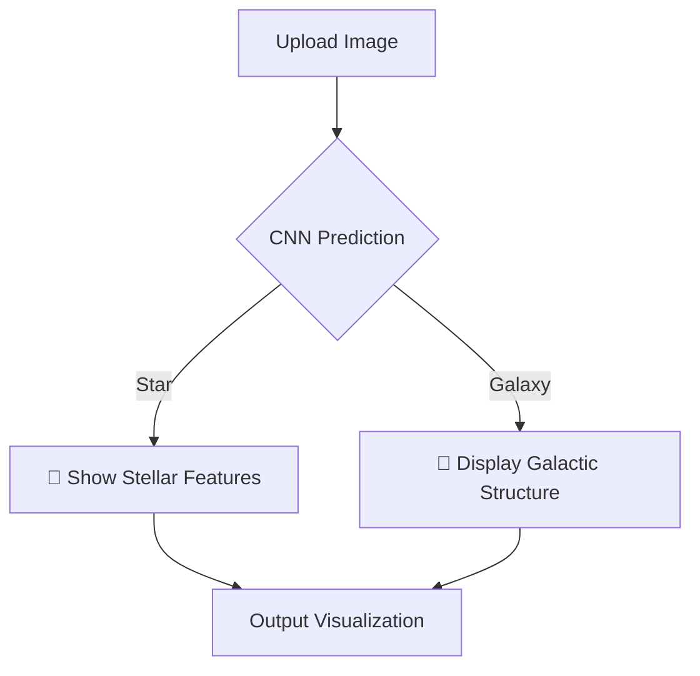

  <h1 style="font-size: 10em; margin-bottom: 180px;">
    Classifying Stars and Galaxies with Deep Learning : 
    "IMAGE"
  </h1>

   Realised by : AFAF Hajar & EZZERROUTI Salwa

&nbsp;

## 📌 Table of Contents  
1. 🌀 [Project Overview](#project-overview)  
2. 🌌 [Key Features](#key-features)  
3. 🚀 [Installation: Launch Sequence](#installation-launch-sequence)  
4. 🧑‍💻 [Data Collection](#data-collection)  
5. 🧠 [ Model Architecture](#model-architecture)  
6. 📡 [Training Performance](#training-performance)  
7. 🚀 [Deployment Streamlit with Ngrok](#deployment-streamlit-with-ngrok)  
8. 🖥️ [Streamlit Interface](#streamlit-interface)  
9. 🛠️ [Project Structure](#project-structure)

  

## 🔍 Project Overview 
This project leverages **Convolutional Neural Networks (CNNs)** to classify astronomical images into **stars** or **galaxies**. The model is trained on a dataset of labeled images and deployed via a **Streamlit web interface** for easy predictions.  
**End-to-End Deep Learning Solution** for classifying astronomical objects, developed for Université Mohammed V's Master IT program. This project demonstrates:
- Data collection from Kaggle's astronomy dataset
- CNN model training with TensorFlow
- Deployment via Streamlit web interface
- Ngrok tunneling for public access

**Modality**: Image Classification  
**Use Case**: Distinguishing stars from galaxies in telescope images

[↑ Back to Top](#table-of-contents)

---

## ✨ Key Features 
✅ **Interactive Web Interface** (Streamlit) 

✅ **CNN Model** with TensorFlow/Keras : 2 Conv layers + MaxPooling	TensorFlow/Keras 

✅ **Real-Time Predictions** with Confidence Scores  

✅ **Data  Pipeline** for improved generalization : Automated Kaggle download + preprocessing	KaggleHub, TensorFlow

✅ **Visualization** of training metrics (Accuracy/Loss)  

✅ **Deployment** Public URL generation	Ngrok

[↑ Back to Top](#table-of-contents)

  

## ⚙️ Installation 

### Prerequisites  
- Python 3.8+  
- pip (Python package manager)

### Google colab link
https://colab.research.google.com/drive/1uoveRNhfdHzmElNVr57p6EyCLzvLNW0Z?usp=sharing

### Installation et importation de bibliothèques Python  
!pip install tensorflow kagglehub matplotlib
!pip install streamlit pyngrok
import tensorflow as tf
import numpy as np
import matplotlib.pyplot as plt
from sklearn.model_selection import train_test_split
import os
from pathlib import Path

## 🧑‍💻Data Collection

data_path = Path(kagglehub.dataset_download("divyansh22/dummy-astronomy-data"))

print(f"🌟 Stars: {len(stars)} | 🌌 Galaxies: {len(galaxies)}")

  
  
Schéma technique - Master IT 2025

  
## 🧠 Model Architecture

         model = tf.keras.models.Sequential([
    tf.keras.layers.Conv2D(32, (3,3), activation='relu', input_shape=(64,64,3)),
    tf.keras.layers.MaxPooling2D(2,2),
    tf.keras.layers.Conv2D(64, (3,3), activation='relu'),
    tf.keras.layers.MaxPooling2D(2,2),
    tf.keras.layers.Flatten(),
    tf.keras.layers.Dense(64, activation='relu'),
    tf.keras.layers.Dense(2, activation='softmax')
    ])
    

## 📡 Training Performance

| Metric       | Training | Validation |
|--------------|----------|------------|
| **Accuracy** | 100%      | 88%        |
| **Loss**     | 0.0038     | 0.58    |

## 🚀 Deployment Streamlit with Ngrok

from pyngrok import ngrok
import time
ngrok.kill()
!streamlit run app.py &>/content/logs.txt &
time.sleep(5)
public_url = ngrok.connect("http://localhost:8501")
print(f"🚀 Ton app est accessible ici : {public_url}")

N.B: Essayez d'obtenir votre authotoken par: https://dashboard.ngrok.com/get-started/your-authtoken 

## 🖥️ Streamlit Interface

## 🛠️ Project Structure

project3/
        ├── data_Preparation.ipynb                   
        ├── app.py                  
        ├── train.ipynb           
        ├── requirements.txt
        ├──model.ipynb
        ├──streamlit.py
        └── README.md 
        

